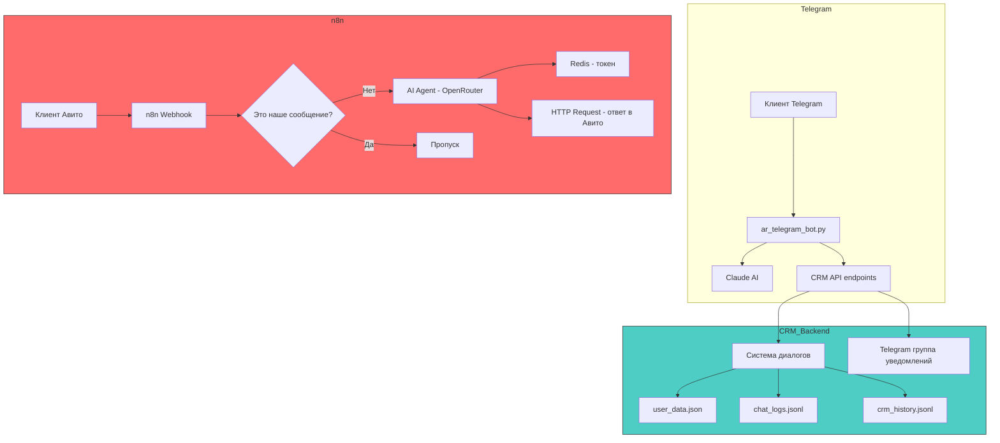
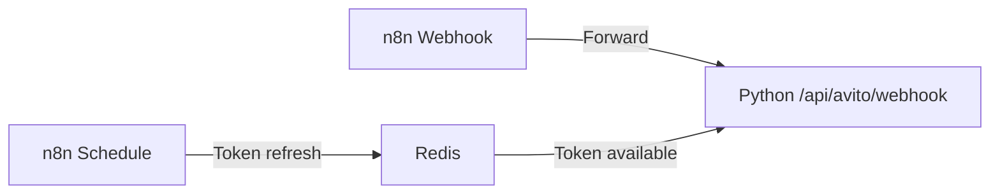
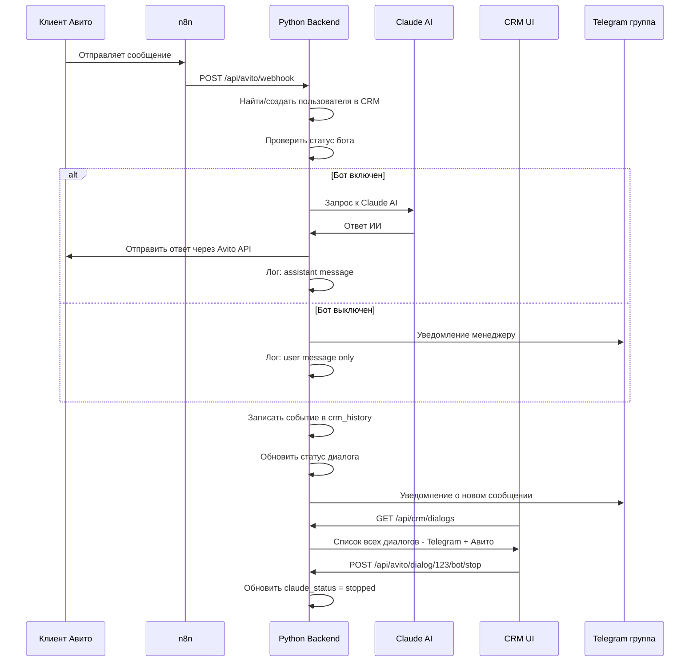

# План интеграции Авито с CRM

## Текущая архитектура



## Проблема текущей архитектуры

n8n AVITO BOT работает **изолированно** от CRM:
- ❌ Нет видимости диалогов в CRM
- ❌ Нет управления ботом - вкл/выкл
- ❌ Сообщения не логируются в chat_logs.jsonl
- ❌ События не пишутся в crm_history.jsonl
- ❌ Нет уведомлений в Telegram группу
- ❌ AI Agent использует OpenRouter вместо Claude
- ❌ Нет связи user_id Авито с user_id CRM

---

## Предлагаемая архитектура: Гибридный подход

```mermaid
graph TB
    subgraph Avito
        AVITO_USER[Клиент Авито] --> AVITO_API[Avito Messenger API]
    end

    subgraph n8n - Транспортный слой
        WEBHOOK[n8n Webhook] --> FORWARD[Forward to Python Backend]
        TOKEN[n8n Schedule - обновление токена] --> REDIS[Redis]
    end

    subgraph Python Backend - Единый CRM
        AVITO_ENDPOINT[/api/avito/webhook] --> ROUTER{Маршрутизатор}
        ROUTER -->|Новое сообщение| PROCESS[Обработка сообщения]
        ROUTER -->|Наше сообщение| LOG_ONLY[Только логирование]

        PROCESS --> CHECK_BOT{Бот включен?}
        CHECK_BOT -->|Да| CLAUDE_AI[Claude AI - единый промпт]
        CHECK_BOT -->|Нет| NOTIFY[Уведомление менеджеру]

        CLAUDE_AI --> SEND_AVITO[Отправка в Авито API]
        SEND_AVITO --> LOG_CHAT[Логирование в chat_logs]
        LOG_CHAT --> LOG_EVENT[Событие в crm_history]
        LOG_EVENT --> UPDATE_DIALOG[Обновление статуса диалога]
        UPDATE_DIALOG --> TG_NOTIFY[Уведомление в Telegram группу]

        NOTIFY --> LOG_CHAT
        LOG_ONLY --> LOG_CHAT
    end

    subgraph CRM UI
        CRM_PAGE[CRMPage.tsx] -->|Показывает диалоги| DIALOG_LIST
        DIALOG_LIST[Список диалогов] -->|Авито + Telegram| CHAT_VIEW[Окно чата]
        CHAT_VIEW -->|Управление| BOT_TOGGLE[Вкл/Выкл бот]
        CHAT_VIEW -->|Ручной ответ| MANUAL_SEND[Отправка сообщения]
    end

    AVITO_API --> WEBHOOK
    REDIS --> AVITO_ENDPOINT
    BOT_TOGGLE --> CHECK_BOT

    style n8n - Транспортный слой fill:#ffd93d,stroke:#333
    style Python Backend - Единый CRM fill:#4ecdc4,stroke:#333
    style CRM UI fill:#6c5ce7,stroke:#333
```

---

## Почему гибридный подход, а не полностью n8n или полностью Python?

### Вариант 1: Всё в n8n ❌
- Сложно интегрировать с существующей CRM - нужны API вызовы в обе стороны
- AI Agent в n8n менее управляемый чем прямой Claude API
- Два источника истины для состояния диалогов
- Две системы для поддержки

### Вариант 2: Всё в Python ✅ Рекомендуется
- Единый код, единая CRM, полная управляемость
- Переиспользование существующей инфраструктуры диалогов
- n8n используется только как транспорт - приём вебхука и обновление токена
- CRM UI уже имеет все нужные компоненты

### Итог: n8n = транспорт, Python = бизнес-логика

---

## Детальный план реализации

### Шаг 1: Создать `avito_client.py` - клиент Авито API

```python
# backend/avito_client.py
class AvitoClient:
    """Клиент для работы с Avito Messenger API"""

    def __init__(self, client_id, client_secret, redis_host, redis_port):
        self.client_id = client_id
        self.client_secret = client_secret
        self.redis = redis  # Токен из Redis - обновляется n8n

    async def get_access_token(self) -> str:
        """Получить токен из Redis или запросить новый"""

    async def send_message(self, chat_id: str, text: str) -> dict:
        """Отправить сообщение в чат Авито"""

    async def get_chat_messages(self, chat_id: str, limit: int = 50) -> list:
        """Получить историю сообщений чата"""

    async def mark_as_read(self, chat_id: str, message_id: str):
        """Пометить сообщение как прочитанное"""
```

### Шаг 2: Создать `avito_integration.py` - модуль интеграции с CRM

```python
# backend/avito_integration.py
class AvitoCRMIntegration:
    """Связывает Авито-сообщения с существующей CRM системой"""

    def handle_incoming_message(self, webhook_data: dict):
        """Обработка входящего сообщения от Авито"""
        # 1. Извлечь chat_id, user_id, text
        # 2. Найти или создать пользователя в CRM (source=avito)
        # 3. Проверить статус бота для этого пользователя
        # 4. Если бот включен - отправить в Claude AI
        # 5. Если бот выключен - уведомить менеджера
        # 6. Залогировать в chat_logs.jsonl
        # 7. Записать событие в crm_history.jsonl
        # 8. Обновить статус диалога
        # 9. Отправить уведомление в Telegram группу

    def handle_outgoing_message(self, chat_id: str, text: str):
        """Логирование исходящего сообщения - от менеджера или бота"""

    def get_avito_dialog_status(self, avito_user_id: str) -> dict:
        """Получить статус диалога с пользователем Авито"""

    def toggle_avito_bot(self, avito_user_id: str, action: str):
        """Включить/выключить бота для конкретного пользователя"""
        # action: start, stop, pause, resume
```

### Шаг 3: Добавить API endpoints в `web_integration.py`

```python
# Добавить в web_integration.py

@app.post("/api/avito/webhook")
async def avito_webhook(request: Request):
    """Приём вебхуков от n8n - входящие сообщения Авито"""

@app.post("/api/avito/send_message")
async def avito_send_message(request: Request):
    """Отправка сообщения менеджером через CRM UI"""

@app.get("/api/avito/dialog/{avito_user_id}/status")
async def avito_dialog_status(avito_user_id: str):
    """Статус диалога с пользователем Авито"""

@app.post("/api/avito/dialog/{avito_user_id}/bot/{action}")
async def avito_bot_control(avito_user_id: str, action: str):
    """Управление ботом: start/stop/pause/resume"""
```

### Шаг 4: Модифицировать n8n воркфлоу

Упростить n8n до транспортного слоя:



n8n делает только:
1. Принимает вебхук от Авито
2. Форвардит данные на Python backend
3. Обновляет токен в Redis каждые 23 часа

Вся бизнес-логика - в Python.

### Шаг 5: Расширить модель данных CRM

Добавить поддержку источника `avito` в `user_data.json`:

```json
{
  "user_id": "avito_123456789",
  "username": "Иван Петров",
  "source": "avito",
  "avito_chat_id": "chat_uuid",
  "avito_user_id": 123456789,
  "status": "pre_booking",
  "dialog": {
    "active": true,
    "has_new_messages": true,
    "last_message_from": "client",
    "last_message_at": "2026-05-11T18:00:00Z",
    "message_count": 5,
    "claude_status": "active"
  }
}
```

### Шаг 6: Обновить CRM UI - `CRMPage.tsx`

- Добавить фильтр по источнику: Все / Telegram / Авито
- Показывать бейдж источника в карточке клиента
- В окне чата - индикатор источника
- Кнопки управления ботом - уже существуют для Telegram, расширить для Авито

---

## Схема потока данных



---

## Файлы для создания/изменения

| Файл | Действие | Описание |
|------|----------|----------|
| `backend/avito_client.py` | Создать | Клиент Avito Messenger API |
| `backend/avito_integration.py` | Создать | Интеграция Авито с CRM системой |
| `backend/web_integration.py` | Изменить | Добавить /api/avito/* endpoints |
| `backend/ar_telegram_bot.py` | Изменить | Добавить уведомления из Авито |
| `backend/crm_adapter.py` | Изменить | Поддержка source=avito |
| `backend/.env` | Изменить | Добавить AVITO_CLIENT_ID, AVITO_CLIENT_SECRET |
| n8n AVITO BOT | Изменить | Упростить до транспортного слоя |
| `src/pages/admin/CRMPage.tsx` | Изменить | Фильтр по источнику, бейджи |

---

## Преимущества подхода

1. **Единая CRM** - все диалоги в одном месте - Telegram + Авито
2. **Управляемость** - вкл/выкл бота для каждого клиента отдельно
3. **Видимость** - все сообщения логируются и видны в CRM UI
4. **Единый AI** - Claude AI с одинаковым промптом для всех каналов
5. **Уведомления** - менеджер видит новые сообщения в Telegram группе
6. **Масштабируемость** - легко добавить другие каналы - WhatsApp, VK и т.д.
7. **n8n как транспорт** - простая замена если понадобится
